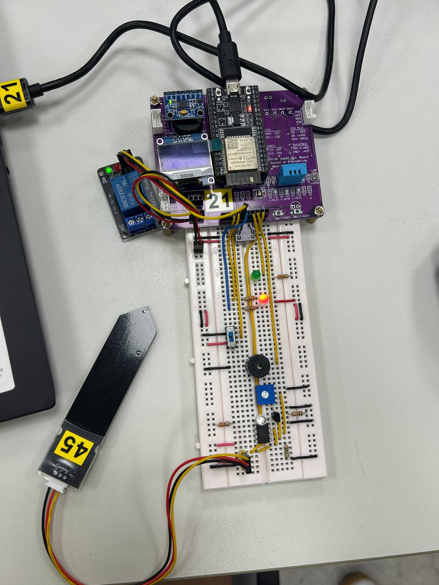
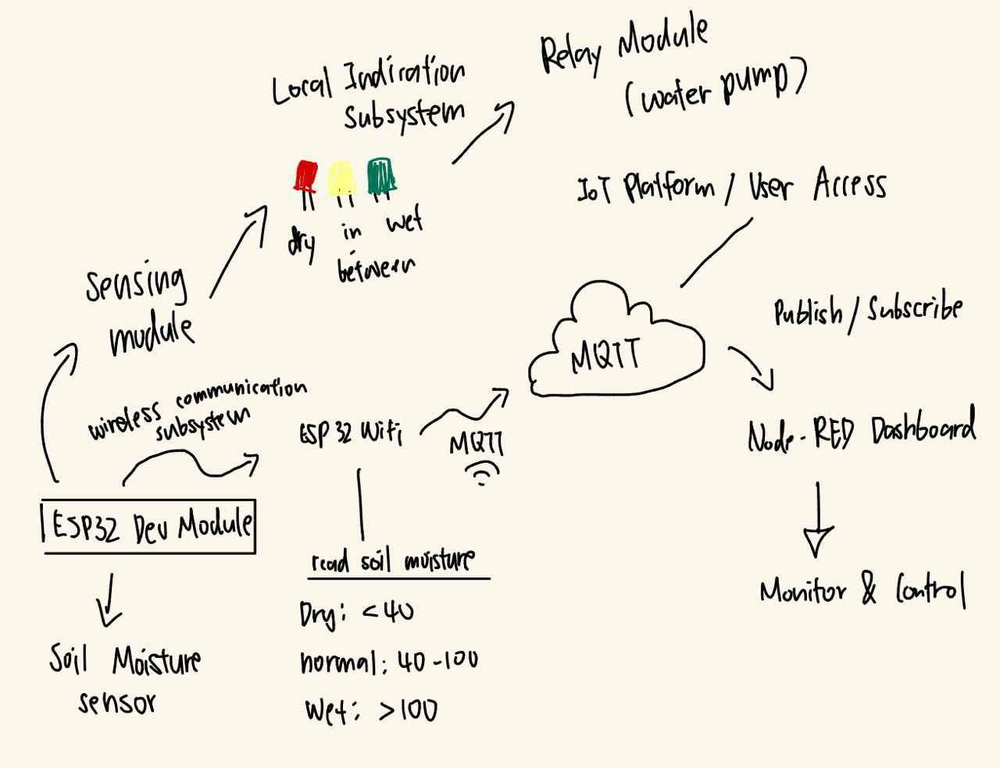
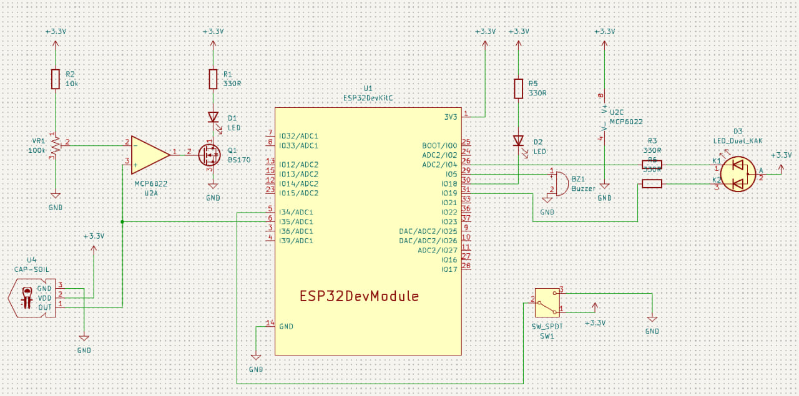
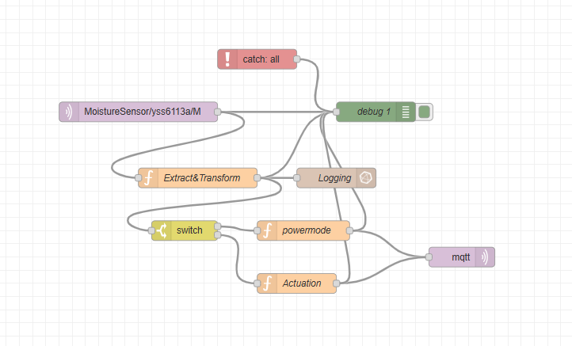

# ESP32 Soil Moisture Monitoring & Irrigation System

An end-to-end IoT system for monitoring soil moisture and automating irrigation.
An ESP32 reads a capacitive soil probe, classifies the reading into dry / normal
/ wet, shows the state on local indicators with an audible dry alarm, and
publishes telemetry over MQTT. A Node-RED flow logs the data to InfluxDB,
visualises it in Grafana, and sends commands back to the device to switch a
relay-driven water pump.



---

## Problem

Water is essential for plant growth, but maintaining optimal soil moisture is
difficult given changing weather and manual irrigation practices. Overwatering
causes root damage and nutrient loss; underwatering causes plant stress and
reduced yield. In urban farming and agriculture, consistent and efficient water
management is necessary for healthy crop production.

This project addresses that with an IoT-based soil moisture monitoring system
that provides real-time soil condition data and supports accurate, efficient
irrigation control — including remote and automated pump actuation.

## System architecture

The system is built from five subsystems:



| Subsystem | Role |
|---|---|
| **Soil moisture sensing** | ESP32 reads a capacitive probe on an ADC pin, converts the raw value to a calibrated moisture level, and classifies it as DRY / NORMAL / WET |
| **Local indication** | A dual-colour LED plus a status LED and buzzer give immediate visual and audible feedback, with no network dependency |
| **Irrigation control** | A relay on a GPIO pin switches a water pump on or off |
| **Wireless communication** | ESP32 WiFi carries MQTT publish/subscribe traffic — telemetry up, pump commands down |
| **IoT platform / user access** | Node-RED applies threshold logic and logs to InfluxDB; Grafana renders the dashboard for remote monitoring and control |

```
  ESP32 ──▶ ADC ──▶ calibration ──┬──▶ LEDs + buzzer      (local, no network)
                                  │
                                  └──▶ JSON ──MQTT──▶ Node-RED ──┬──▶ InfluxDB ──▶ Grafana
                                                                 │
                                       relay ◀──MQTT── downlink ◀┘  threshold logic
```

Putting the threshold logic in Node-RED rather than the firmware means watering
rules can be retuned from the browser without reflashing the device. The local
alert path stays independent, so LEDs and buzzer keep working if WiFi or the
broker goes down — the device degrades to a standalone moisture meter rather
than failing silently.

## Hardware design



The circuit was designed in KiCad. Beyond wiring the ESP32 to the sensor and
indicators, it includes an **MCP6022 op-amp stage** with a 100 kΩ trim pot
(`VR1`) acting as an adjustable comparator, driving a BS170 MOSFET and status
LED. This gives a hardware-level dry indication whose trip point can be set with
a screwdriver, independent of anything running in firmware.

| Component | Connection | Notes |
|---|---|---|
| ESP32 Dev Module | — | 2.4 GHz WiFi only |
| Capacitive soil probe (`U4`) | GPIO 35 (ADC1) | Analog output, inverted |
| MCP6022 op-amp (`U2A`, `U2C`) | — | Comparator stage, threshold set by `VR1` |
| BS170 MOSFET (`Q1`) | — | Drives indicator LED `D1` |
| Dual-colour LED (`D3`) | GPIO 19 / GPIO 4 | Active **LOW** |
| Status LED (`D2`) | GPIO 18 | Dry-state indicator |
| Buzzer (`BZ1`) | GPIO 5 | |
| SPDT mute switch (`SW1`) | GPIO 34 | Silences the dry alarm |
| Toggle button | GPIO 27 | Edge-detected in software |
| Relay module | GPIO 23 | Active **LOW**, drives the pump |
| Battery divider | GPIO 36 (read) / GPIO 13 (enable) | 1:2 divider, 4.2 V full scale |

## How it works

### Calibrating the sensor

The probe output is inverted (dry soil reads a *higher* voltage) and the ESP32's
ADC is non-linear, so the raw value goes through three conversions:

```c
sensor = analogRead(mysensor);            // 12-bit, 0..4095
sensor = (sensor + 100) * 2048 / 1988;    // correct ESP32 ADC non-linearity
sensor = sensor * 0.0008;                 // counts → volts
sensor = (sensor - 3) / (-0.02);          // volts → % moisture
```

The last line is a two-point linear calibration: **3.0 V → 0%** (probe in air)
and **1.0 V → 100%** (probe in saturated soil). The negative slope is what flips
the inverted sensor reading the right way round.

### Local indication

| Moisture | Indicator | State |
|---:|---|---|
| ≥ 100 | 🟢 Green | Wet |
| 80–100 | 🟡 Green + Red together | Normal |
| 40–80 | 🔴 Red | Normal, drying |
| < 40 | 🔴 Red + status LED + 🔊 buzzer | **Dry** — alarm |

The buzzer can be silenced mid-alarm with the SPDT switch. The mute clears
automatically once moisture recovers to ≥ 100, so acknowledging one dry spell
never suppresses the next.

The final branch is a catch-all `else`, so an out-of-range or negative reading
from a disconnected probe raises the alarm rather than leaving every indicator
dark.

### Telemetry

Every 10 seconds the device publishes a compact JSON payload built with
ArduinoJson. Keys are single characters to keep airtime low on a battery-powered
node:

```json
{ "v": 742, "b": 87, "r": 0 }
```

| Key | Meaning |
|---|---|
| `v` | Moisture × 10 — carries one decimal place as an integer, avoiding float encoding |
| `b` | Battery charge, % of a 4.2 V full charge |
| `r` | Relay state (1 = pump on) |

Battery level is read by briefly enabling a 1:2 divider, sampling the halved
voltage on a separate ADC channel, and scaling against the 4.2 V maximum.

### Commands

The device subscribes to a downlink topic; a payload of `HI` energises the relay
and anything else releases it. Topics are assembled at boot from `parameters.h`:

```
publish   →  MoistureSensor/<clientid>/M
subscribe →  DL/MoistureSensor/<clientid>/M
```

### Cloud side



The Node-RED flow ([`node-red/flow.json`](node-red/flow.json)) subscribes to the
uplink topic and runs it through `Extract&Transform` to parse the payload, then:

- **`Logging`** writes each reading to InfluxDB for long-term history
- **`switch`** routes on moisture thresholds
- **`powermode`** and **`Actuation`** build the downlink command
- **`mqtt out`** publishes it back to the device to drive the pump
- **`catch: all`** handles node failures so a bad payload doesn't stall the flow

Grafana reads from InfluxDB to render the dashboard — a live moisture gauge,
relay status, and history:


## Technologies

**Firmware** — C/C++ on the Arduino framework for ESP32
**Libraries** — `WiFi`, `PubSubClient` (MQTT), `ArduinoJson`, `WiFiClientSecure`
**Protocol** — MQTT, with optional TLS to HiveMQ Cloud or Mosquitto
**Hardware design** — KiCad
**Cloud** — Node-RED (flow logic), InfluxDB (time-series storage), Grafana (dashboard)

## Getting started

You'll need the [Arduino IDE](https://www.arduino.cc/en/software) with the ESP32
board package, plus the libraries above via **Tools → Manage Libraries**.

**1. Clone and add your credentials**

```bash
git clone https://github.com/shanshannnnnn/esp32-soil-moisture-monitor.git
```

```bash
cd esp32-soil-moisture-monitor/soil_moisture_monitor
```

```bash
cp credentials.example.h credentials.h
```

Fill in your WiFi SSID/password and MQTT broker details. `credentials.h` is
gitignored and will not be committed.

**2. Set your MQTT identity**

In `parameters.h`, change `clientid` to something unique — on a shared broker,
two devices with the same client ID disconnect each other.

**3. Choose features**

`profile.h` controls what gets compiled in:

```c
#define Publish        // send readings
#define Subscribe      // accept remote commands
//#define HIVEMQS      // uncomment for TLS via HiveMQ Cloud
//#define MOSQUITTOS   // uncomment for TLS via test.mosquitto.org
```

For either TLS option, also `cp cert.example.h cert.h` and paste in your
broker's CA root certificate.

**4. Flash and calibrate**

Upload and open the Serial Monitor at **115200 baud** for readings every 10
seconds. To calibrate for your own probe and soil: note the reading with the
probe in air, then in thoroughly watered soil, and adjust the `3` and `-0.02`
constants so those two points map to 0% and 100%.

**5. Import the cloud flow**

In Node-RED, **Menu → Import** and paste [`node-red/flow.json`](node-red/flow.json).
Set your own broker and InfluxDB details in the config nodes — they're
placeholdered in the export.

## Possible improvements

- **Blocking WiFi connect.** `setup_wifi()` spins until the network appears, so
  the device never reaches its main loop if WiFi is down at boot — which
  undercuts the offline-capable alert path. It should time out and continue in
  standalone mode.
- **Calibration is compiled in.** Storing the two constants in NVS and exposing
  a calibration routine over MQTT would allow recalibration without reflashing.
- **No buffering.** Readings taken while the broker is unreachable are dropped
  rather than queued, leaving gaps in the history.

## Reflections

Through the development of this system I gained a deeper understanding of how
sensing, processing, and cloud communication integrate in a real-world IoT
application. I learned how to interface a soil moisture sensor with the ESP32,
convert analogue readings into meaningful values, and apply threshold logic for
decision-making.

The project strengthened my knowledge of MQTT and remote monitoring, and gave me
a better understanding of how publish/subscribe models enable real-time data
transmission and remote control of devices such as a relay-driven water pump.

Overall it developed my skills in embedded systems, wireless communication, and
system integration, while increasing my awareness of how IoT solutions can
improve efficiency and sustainability in agriculture.

## License

MIT — see [LICENSE](LICENSE).
